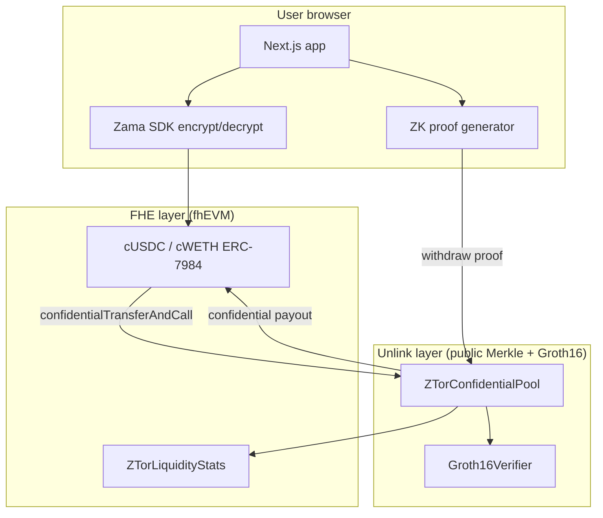
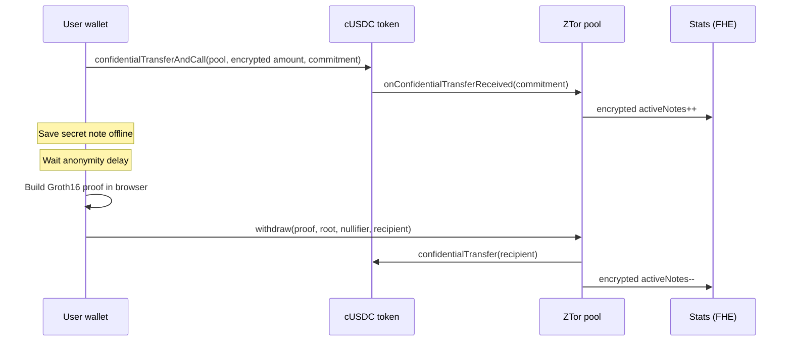

# Z-Tor

**Confidential fixed-denomination transfer pools on Ethereum Sepolia** — combining note-based unlinkability (mixer-style ZK proofs) with **Zama fhEVM** for encrypted on-chain economics and **ERC-7984** confidential tokens.

> **Status:** Core flow working on Sepolia testnet (shield → deposit → wait → withdraw). Testnet only — no mainnet.

---

## Demo

| Service | URL |
|---------|-----|
| Web app | [http://localhost:3000](http://localhost:3000) (after `npm run dev:web`) |
| Relayer (optional) | [http://localhost:8787](http://localhost:8787) |

Connect **MetaMask** to **Sepolia**. You need a little test ETH for gas.

---

## Quick start

**Requirements:** Node.js 20+, MetaMask on Sepolia.

```bash
git clone <repo-url>
cd Z-Tor
npm install

# Run contract tests (mock FHE locally)
npm test -w @z-tor/contracts

# Start web UI
npm run dev:web

# Optional: gasless withdraw relayer
npm run dev:relayer
```

Copy `apps/web/.env.example` → `apps/web/.env.local` and set RPC + registry addresses (see [docs/DEPLOYMENTS.md](docs/DEPLOYMENTS.md)).

---

## What Z-Tor does

1. **Shield** — mint Zama test USDC/WETH, wrap to confidential **cUSDC / cWETH**
2. **Deposit** — send a fixed pool amount; receive a **secret note**
3. **Wait** — ~10 minute privacy delay (unlinkability)
4. **Withdraw** — spend the note to any recipient (relayer or your wallet)

Tokens use [official Zama Sepolia addresses](https://docs.zama.org/protocol/protocol-apps/addresses/testnet/sepolia).

---

## Architecture





See [docs/ARCHITECTURE.md](docs/ARCHITECTURE.md) and [docs/USER_GUIDE.md](docs/USER_GUIDE.md) for detail.

---

## Repository layout

```
Z-Tor/
├── apps/
│   ├── web/                 # Next.js frontend (wagmi, Zama SDK, ZK proofs)
│   └── relayer/             # Optional gasless withdraw relay
├── packages/
│   └── contracts/           # Hardhat + fhEVM Solidity
│       ├── contracts/       # Pool, factory, registry, stats
│       ├── test/            # Hardhat tests (mock FHE)
│       └── deploy/          # Sepolia deploy scripts
├── docs/                    # Product & technical documentation
├── scripts/                 # Monorepo helper scripts
├── README.md                # You are here
└── AGENTS.md                # AI / contributor contract rules
```

Full map: [docs/REPOSITORY_STRUCTURE.md](docs/REPOSITORY_STRUCTURE.md).

---

## Smart contracts

| Contract | Role |
|----------|------|
| `ZTorRegistry` | Maps pool IDs → pool addresses |
| `ZTorPoolFactory` | Permissionless custom-denomination pools |
| `ZTorConfidentialPool` | Fixed pools: Merkle deposits + FHE token payout |
| `ZTorLiquidityStats` | Encrypted active-note counters (fhEVM) |
| `Groth16Verifier` | On-chain proof verification |

Sepolia addresses: [docs/DEPLOYMENTS.md](docs/DEPLOYMENTS.md).

Compile & lint:

```bash
npm run compile -w @z-tor/contracts
node .tools/fhevm-skill/scripts/fhevm-lint.js packages/contracts/contracts/
```

Deploy Sepolia:

```bash
cd packages/contracts
npx hardhat vars setup
npm run deploy:sepolia -w @z-tor/contracts
```

---

## Test results

Run: `npm test -w @z-tor/contracts`

```
  MerkleTreeWithHistory
    ✔ computes the same initial root as the reference tree
    ✔ matches the reference tree across several inserts
    ✔ remembers recent roots and rejects unknown ones
    ✔ rejects inserts once the tree is full

  Withdraw with real Groth16 proof
    ✔ withdraws with a valid proof and rejects a tampered recipient
    ✔ pays a relayer fee and rejects a relayer raising its own fee
    ✔ rejects a proof for a commitment that is not in the tree

  ZTorERC20Pool
    ✔ pulls the exact token denomination on deposit
    ✔ rejects deposits that send ETH along
    ✔ rejects deposits without allowance
    ✔ transfers tokens to the recipient on withdraw
    ✔ pays the relayer fee in tokens

  ZTorETHPool
    deposit
      ✔ accepts the exact denomination and emits Deposit
      ✔ rejects a wrong deposit amount
      ✔ rejects a duplicate commitment
      ✔ rejects commitments outside the field
    withdraw
      ✔ pays the recipient after the delay
      ✔ pays the relayer fee and the recipient the remainder
      ✔ rejects a fee larger than the denomination
      ✔ rejects a fee without a relayer
      ✔ rejects a withdrawal before the delay has passed
      ✔ rejects double-spends of the same nullifier
      ✔ rejects an unknown root
      ✔ rejects when the verifier says the proof is invalid

  ZTorLiquidityStats
    ✔ rejects unregistered callers
    ✔ rejects duplicate pool registration and non-owner registration
    ✔ lets a registrar register pools
    ✔ counts deposits and withdrawals encrypted, decryptable by owner

  ZTorPoolFactory
    ✔ creates an ETH pool and registers it
    ✔ creates a USDC pool and registers it
    ✔ rejects duplicate pools and out-of-range denominations

  ZTorRegistry
    ✔ registers and resolves pools
    ✔ rejects duplicates, zero addresses, and unknown lookups
    ✔ only lets the owner or a registrar register

  34 passing
```

Tests use **Hardhat mock FHE** locally; Sepolia uses Zama's live fhEVM coprocessor.

---

## Documentation

| Doc | Audience |
|-----|----------|
| [docs/README.md](docs/README.md) | Documentation index |
| [docs/USER_GUIDE.md](docs/USER_GUIDE.md) | Non-technical walkthrough |
| [docs/GETTING_STARTED.md](docs/GETTING_STARTED.md) | Developers setup |
| [docs/ARCHITECTURE.md](docs/ARCHITECTURE.md) | System design |
| [docs/DEPLOYMENTS.md](docs/DEPLOYMENTS.md) | Sepolia addresses |
| [docs/PRIVACY_AND_COMPLIANCE.md](docs/PRIVACY_AND_COMPLIANCE.md) | Privacy boundary |
| [docs/ROADMAP.md](docs/ROADMAP.md) | Project phases |

In-app: **FAQ** (`/faq`), **How it works** (`/how-it-works`).

Official Zama protocol docs: [docs.zama.org/protocol](https://docs.zama.org/protocol)

---

## Tech stack

| Layer | Stack |
|-------|--------|
| Contracts | Solidity 0.8.27, Hardhat, `@fhevm/solidity`, OpenZeppelin confidential ERC-7984 |
| ZK | Circom / Groth16 (withdraw membership proof) |
| Frontend | Next.js 15, wagmi, viem, `@zama-fhe/react-sdk`, Framer Motion |
| Relayer | Node.js + viem |

---

## License

MIT — see [LICENSE](LICENSE).

---

## For reviewers & AI agents

Read [AGENTS.md](AGENTS.md) before editing contracts. fhEVM changes must pass `fhevm-lint`. Never branch on encrypted values on-chain; use `FHE.select`.
