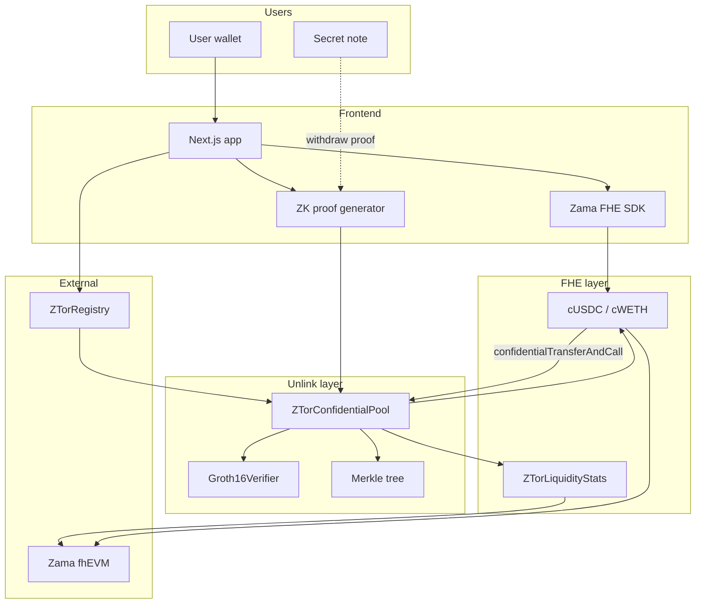
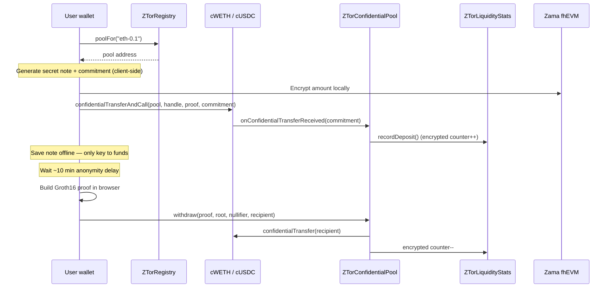
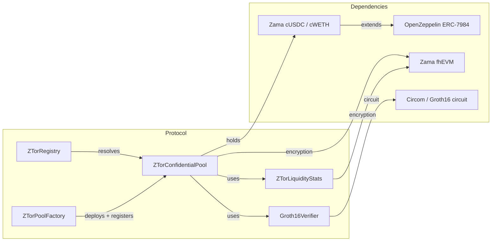

<div align="center">

# Z-Tor

**Confidential fixed-denomination privacy pools on Ethereum**  
*Note-based unlinkability + Zama fhEVM + ERC-7984 confidential tokens*

[🚀 Live App](https://z-tor-web.vercel.app/app) • [📚 Documentation](https://rams-4.gitbook.io/rams-docs) • [🔍 Etherscan (Sepolia)](https://sepolia.etherscan.io/address/0x21E4D83C5C4329Cad8f59bc7408C49d24A3D39d2#code)

[Features](#features) • [Architecture](#architecture) • [Quick Start](#quick-start) • [Smart Contracts](#smart-contracts) • [Test Results](#test-results)

</div>

---

## Live Deployments

| Platform | URL |
|----------|-----|
| 🚀 **App** | [z-tor-web.vercel.app/app](https://z-tor-web.vercel.app/app) |
| 📚 **Docs (GitBook)** | [rams-4.gitbook.io/rams-docs](https://rams-4.gitbook.io/rams-docs) |
| ⚡ **Relayer** | [z-tor-web.vercel.app/api/relayer/info](https://z-tor-web.vercel.app/api/relayer/info) |
| 🛠 **Local dev** | `http://localhost:3000` (landing) · `/app` (dApp) |

Connect **MetaMask** to **Sepolia**. You need a little test ETH for gas. **Testnet only — no mainnet.**

---

## Overview

Z-Tor is a privacy tool on Ethereum Sepolia that lets you move **confidential cUSDC and cWETH** through shared fixed-denomination pools. Deposits and withdrawals are **not publicly linked** on-chain — you hold a secret **note** as the only key to your funds.

It combines two layers that most projects keep separate:

- **Unlink layer** — Merkle commitments, nullifiers, and Groth16 zero-knowledge proofs (mixer-style)
- **FHE layer** — Zama fhEVM for encrypted pool stats and confidential token accounting

Unlike plain blockchain transfers where anyone can trace your history, Z-Tor breaks the deposit→withdraw link while keeping amounts encrypted via [Zama's ERC-7984](https://docs.zama.org/protocol) confidential tokens.

### Why Z-Tor?

| Traditional payments | Plain blockchain | Z-Tor |
|----------------------|------------------|-------|
| ✅ Amount private | ❌ Amount public | ✅ Amount encrypted (cUSDC/cWETH) |
| ❌ Centralized | ✅ Decentralized | ✅ Decentralized |
| ❌ Slow settlement | ✅ Fast settlement | ✅ Fast settlement |
| ❌ Full history visible to bank | ❌ Full history on-chain | ✅ Deposit/withdraw unlinkable |
| ❌ Custodian holds keys | ✅ Self-custody | ✅ Self-custody (secret note) |

---

## Features

### 🔐 Dual privacy architecture

- **Unlinkability** — Groth16 proof shows membership in the pool without revealing which deposit is yours
- **Confidential amounts** — pools hold ERC-7984 cUSDC/cWETH; balances are encrypted on-chain
- **Encrypted deposit check** — the pool verifies each deposit equals the pool size via a homomorphic compare + Zama public decryption, so a note only goes live once the amount is confirmed (wrong amounts auto-refund)
- **FHE stats** — encrypted active-note counters via fhEVM, revealable on the Stats page

### 💸 Core user flow

- **Shield** — mint Zama test tokens, wrap to confidential cUSDC/cWETH
- **Deposit** — pick a fixed pool tier, save your secret note, send encrypted tokens, then confirm the amount check
- **Wait** — ~10 minute privacy delay (reduces same-block fingerprinting)
- **Withdraw** — spend note to any recipient; optional gasless relayer

### 🪙 Fixed pool tiers

| Pool | Asset | Amount |
|------|-------|--------|
| `eth-0.1` | cWETH | 0.1 |
| `eth-1` | cWETH | 1 |
| `usdc-100` | cUSDC | 100 |
| `usdc-1000` | cUSDC | 1,000 |

Fixed denominations keep every deposit in a tier **identical** — stronger anonymity sets than variable amounts.

### 🛡️ Compliance-friendly options

- **Voluntary disclosure** — export proof of your own deposit history for auditors (`/disclose`)
- **Encrypted aggregate stats** — live fhEVM demo at `/stats`
- **No admin key** to your note — lose the note, lose the funds (by design)

### 🔜 Roadmap

| Status | Item |
|--------|------|
| ✅ Live | Shield, fixed-tier deposit, withdraw, stats, disclose, relayer |
| ✅ Live | All Phase 3c Sepolia contracts verified on Etherscan |
| 🔜 Upcoming | Custom amount pools (`ZTorPoolFactory` + deposit UI) |
| 🔜 Upcoming | Mainnet readiness (legal review, monitoring, upgrade policy) |

Full phase history: [docs/ROADMAP.md](docs/ROADMAP.md)

---

## Testnet Deployment

| Contract | Address | Network |
|----------|---------|---------|
| ZTorRegistry | `0x21E4D83C5C4329Cad8f59bc7408C49d24A3D39d2` | Sepolia |
| ZTorLiquidityStats | `0x11CD2af54025B3209F04b928BD7cA8c64D411e55` | Sepolia |
| Groth16Verifier | `0x04F2ADA900BeCDe03E5306d652049344a6fAdfb5` | Sepolia |
| ZTorPoolFactory | `0x24c4E6dBe47AE08a87C4B7A53a29107CffD96E95` | Sepolia |
| eth-0.1 pool | `0x3FE0Cdb67035ABF0953fbfA1f4032b0F43DB9636` | Sepolia |
| eth-1 pool | `0x9144E1e56D4C592c3CF70b765AAbEb252E8C8417` | Sepolia |
| usdc-100 pool | `0x1993D693C6e1D59323be3935ABA5efc686343FCc` | Sepolia |
| usdc-1000 pool | `0xEA8ef61Bc5B4989fd4c4205B73844d982a0b811b` | Sepolia |
| cUSDC (Zama) | `0x7c5BF43B851c1dff1a4feE8dB225b87f2C223639` | Sepolia |
| cWETH (Zama) | `0x46208622DA27d91db4f0393733C8BA082ed83158` | Sepolia |

All Z-Tor contracts above are **source-verified** on Sepolia Etherscan. Full list + env vars: [docs/DEPLOYMENTS.md](docs/DEPLOYMENTS.md).

---

## Architecture

### High-Level Overview



### Deposit Flow



### Contract Architecture



See [docs/ARCHITECTURE.md](docs/ARCHITECTURE.md) for the full design write-up.

---

## Quick Start

### Prerequisites

- Node.js 20+
- MetaMask (or compatible wallet) on **Sepolia**
- Sepolia ETH for gas ([faucet](https://sepoliafaucet.com/))

### Installation

```bash
# Clone repository
git clone https://github.com/ramakrishnanhulk20/Z-Tor.git
cd Z-Tor

# Install all workspace dependencies
npm install
```

### Environment

```bash
cp apps/web/.env.example apps/web/.env.local
```

Set `NEXT_PUBLIC_ZTOR_REGISTRY` and `NEXT_PUBLIC_DEPLOY_BLOCK` — values in [docs/DEPLOYMENTS.md](docs/DEPLOYMENTS.md).

### Development

```bash
# Compile contracts
npm run compile -w @z-tor/contracts

# Run tests (mock FHE locally)
npm test -w @z-tor/contracts

# Build ZK circuit assets (first time / after circuit changes)
npm run build:circuit -w @z-tor/contracts

# Start web UI
npm run dev:web

# Optional: gasless withdraw relayer
npm run dev:relayer
```

Open [http://localhost:3000](http://localhost:3000). For Sepolia deploy:

```bash
cd packages/contracts
npx hardhat vars setup
npm run deploy:sepolia -w @z-tor/contracts
```

---

## Smart Contracts

### ZTorConfidentialPool

Fixed-denomination pool: Merkle commitments + confidential token deposit/withdraw.

| Function | Description |
|----------|-------------|
| `onConfidentialTransferReceived(...)` | Preferred deposit via `confidentialTransferAndCall` callback |
| `deposit(commitment, encryptedAmount, proof)` | Legacy operator-pull deposit |
| `withdraw(proof, root, nullifierHash, recipient, relayer, fee)` | Spend note; pay out cUSDC/cWETH |
| `denomination()` | Fixed confidential units for this pool tier |
| `token()` | ERC-7984 wrapper address (cUSDC or cWETH) |

### ZTorRegistry

Maps human-readable pool IDs to deployed pool contracts.

| Function | Description |
|----------|-------------|
| `poolFor(poolId)` | Resolve `"eth-0.1"` → pool address |
| `poolExists(poolId)` | Check if a pool id is registered |
| `allPoolIds()` | List all registered pool ids |

### ZTorLiquidityStats

Encrypted on-chain counters (fhEVM).

| Function | Description |
|----------|-------------|
| `recordDeposit()` | Called by pool on deposit (encrypted ++) |
| `recordWithdraw()` | Called by pool on withdraw (encrypted --) |
| `registerPool(poolId, poolAddress)` | Owner/registrar registers a pool |

### Groth16Verifier

On-chain verification of withdraw membership proofs (Circom circuit).

Compile & lint contracts:

```bash
npm run compile -w @z-tor/contracts
node .tools/fhevm-skill/scripts/fhevm-lint.js packages/contracts/contracts/
```

Re-verify on Etherscan after redeploy:

```bash
ETHERSCAN_API_KEY=... npm run verify:sepolia -w @z-tor/contracts
```

---

## Test Results

```
  MerkleTreeWithHistory
    ✔ computes the same initial root as the reference tree
    ✔ matches the reference tree across several inserts
    ✔ remembers recent roots and rejects unknown ones
    ✔ rejects inserts once the tree is full

  Withdraw with real Groth16 proof
    ✔ withdraws with a valid proof and rejects a tampered recipient
    ✔ pays a relayer fee and rejects a relayer raising its own fee
    ✔ rejects a proof for a commitment that is not in the tree

  ZTorERC20Pool
    ✔ pulls the exact token denomination on deposit
    ✔ rejects deposits that send ETH along
    ✔ rejects deposits without allowance
    ✔ transfers tokens to the recipient on withdraw
    ✔ pays the relayer fee in tokens

  ZTorETHPool
    deposit
      ✔ accepts the exact denomination and emits Deposit
      ✔ rejects a wrong deposit amount
      ✔ rejects a duplicate commitment
      ✔ rejects commitments outside the field
    withdraw
      ✔ pays the recipient after the delay
      ✔ pays the relayer fee and the recipient the remainder
      ✔ rejects a fee larger than the denomination
      ✔ rejects a fee without a relayer
      ✔ rejects a withdrawal before the delay has passed
      ✔ rejects double-spends of the same nullifier
      ✔ rejects an unknown root
      ✔ rejects when the verifier says the proof is invalid

  ZTorLiquidityStats
    ✔ rejects unregistered callers
    ✔ rejects duplicate pool registration and non-owner registration
    ✔ lets a registrar register pools
    ✔ counts deposits and withdrawals encrypted, decryptable by owner

  ZTorPoolFactory
    ✔ creates an ETH pool and registers it
    ✔ creates a USDC pool and registers it
    ✔ rejects duplicate pools and out-of-range denominations

  ZTorRegistry
    ✔ registers and resolves pools
    ✔ rejects duplicates, zero addresses, and unknown lookups
    ✔ only lets the owner or a registrar register

  34 passing
```

Run locally: `npm test -w @z-tor/contracts`  
Tests use **Hardhat mock FHE**; Sepolia uses Zama's live fhEVM coprocessor.

---

## Project Structure

```
Z-Tor/
├── apps/
│   ├── web/                    # Next.js frontend (wagmi, Zama SDK, ZK proofs)
│   │   ├── src/app/            # Routes: deposit, withdraw, shield, stats, disclose
│   │   ├── src/lib/            # Note, confidential deposit, withdraw, ZK
│   │   └── public/zk/          # Groth16 wasm + zkey (built from circuit)
│   └── relayer/                # Optional gasless withdraw relay
│
├── packages/
│   └── contracts/              # Hardhat + fhEVM Solidity
│       ├── contracts/          # Pool, registry, factory, stats, verifier
│       ├── test/               # Hardhat tests (mock FHE)
│       ├── deploy/             # Sepolia deploy scripts
│       └── deployments/        # Recorded addresses + solcInputs
│
├── docs/                       # Product & technical documentation
├── scripts/                    # Monorepo helper scripts
├── README.md                   # You are here
└── AGENTS.md                   # Contributor / AI agent rules (fhEVM)
```

Full map: [docs/REPOSITORY_STRUCTURE.md](docs/REPOSITORY_STRUCTURE.md)

---

## Tech Stack

| Layer | Technology |
|-------|------------|
| Smart Contracts | Solidity 0.8.27, Hardhat, `@fhevm/solidity` |
| FHE | Zama fhEVM, OpenZeppelin ERC-7984 confidential tokens |
| ZK | Circom / Groth16 (withdraw membership proof) |
| Frontend | Next.js 15, TypeScript, wagmi, viem, `@zama-fhe/react-sdk` |
| Relayer | Node.js, viem (optional gasless withdraw) |
| Hosting | Vercel (web + built-in relayer API routes) |

---

## Documentation

All guides live on **GitBook** (synced from the `docs/` folder). Setup: [docs/GITBOOK_SETUP.md](docs/GITBOOK_SETUP.md).

| Doc | Topic |
|-----|-------|
| [User guide](docs/USER_GUIDE.md) | Shield, deposit, withdraw |
| [How it works](docs/HOW_IT_WORKS.md) | Product walkthrough |
| [FAQ](docs/FAQ.md) | Common questions |
| [Architecture](docs/ARCHITECTURE.md) | System design |
| [Deployments](docs/DEPLOYMENTS.md) | Sepolia addresses |

Marketing site: `/` · dApp: `/app` · Privacy: `/privacy`

---

## License

MIT License — see [LICENSE](LICENSE) for details.

---

## Acknowledgments

- [Zama](https://www.zama.ai/) — fhEVM, FHE infrastructure, and Sepolia confidential tokens
- [OpenZeppelin](https://www.openzeppelin.com/) — ERC-7984 confidential contract patterns
- [Circle](https://www.circle.com/) — USDC (underlying test assets on Sepolia)

---

<div align="center">

Built with 🔐 by [Ram](https://github.com/ramakrishnanhulk20)

Also see [Aruvi](https://github.com/ramakrishnanhulk20/Aruvi) — confidential P2P payments on fhEVM

</div>
