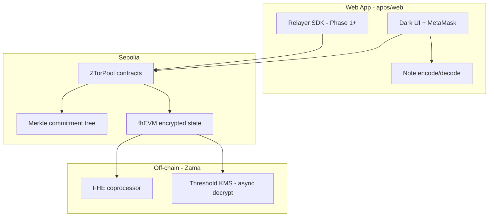

# Z-Tor — Architecture

## High-level system



## Two privacy layers

Z-Tor deliberately separates concerns that are often conflated:

| Layer | Mechanism | Protects |
|-------|-----------|----------|
| **Unlink** | Commitments, nullifiers, Merkle membership (ZK or compatible proof in Phase 1) | Which deposit funded which withdrawal |
| **Amount / pool accounting** | fhEVM (`euint*`, ACL, async decryption) | Plaintext balances and aggregates on-chain |

Fully Homomorphic Encryption does **not** replace a nullifier-style spend proof by itself. Phase 1 implements the **unlink layer** with proven mixer patterns; Phase 1+ grows **FHE** where it adds real value (encrypted pool stats, selective disclosure).

## Monorepo layout

```
z-tor/
├── apps/web/              # Next.js, wagmi, English UI
├── packages/contracts/    # Hardhat, fhEVM, Solidity
├── docs/                  # Product + engineering docs
└── package.json           # npm workspaces root
```

## Smart contracts (planned)

| Contract / module | Responsibility |
|-------------------|----------------|
| `ZTorPool` (per asset + denomination) | Deposit ETH/USDC, emit commitment, track encrypted pool metadata |
| `MerkleTree` library | Fixed-depth tree for commitments |
| `Verifier` | Validates withdraw proof (interface in Phase 0) |
| `ZTorRegistry` | Maps pool id → implementation, pause guardian |

Phase 0 ships **interfaces + FHE smoke compile** (`FHECounter` from official template) so tooling works before pool logic lands.

## Fixed pools (v1)

| Tier | ETH | USDC (Sepolia official) |
|------|-----|-------------------------|
| Small | 0.1 | 100 |
| Large | 1 | 1,000 |

USDC on Sepolia: [Circle faucet](https://faucet.circle.com/) — contract address wired in `apps/web/src/config/assets.ts` after deploy research.

## Withdrawal policy (v1 defaults)

- Withdraw to **any address** (UI warns if same as depositor).
- **~10 minute** minimum delay after deposit (configurable per pool).
- **No relayer** in v1.
- **Note-based** credential; losing the note means losing funds (UI stresses backup).

## Frontend stack

- **Next.js** (App Router), TypeScript, Tailwind
- **wagmi + viem** for Sepolia
- **@zama-fhe/relayer-sdk** integrated in Phase 1 for encrypted inputs
- Contract addresses from `deployments/` or env (`NEXT_PUBLIC_*`)

## Networks

| Network | Chain ID | Use |
|---------|----------|-----|
| Hardhat + fhEVM mock | 31337 | Local tests (`npm test` in contracts) |
| Sepolia | 11155111 | Deploy + manual QA |

## References

- [Zama Protocol docs](https://docs.zama.org/protocol)
- [fhEVM Hardhat template](https://github.com/zama-ai/fhevm-hardhat-template)
- [fhEVM agent skill](https://github.com/0xE1337/fhevm-skill) — recommended for all FHE contract work
